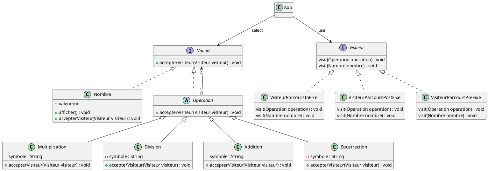

#Mini-projet 2

```plantuml
@startuml
skinparam style strict

class Nombre implements Noeud {
    -valeur:int
    + afficher() : void
    + accepterVisiteur(Visiteur visiteur) : void

}

interface Noeud {

   + accepterVisiteur(Visiteur visiteur) : void
}
abstract class Operation implements Noeud {

    + accepterVisiteur(Visiteur visiteur) : void
}

class Multiplication extends Operation {
    - symbole : String
    + accepterVisiteur(Visiteur visiteur) : void
}
class Division extends Operation{
    - symbole : String
    + accepterVisiteur(Visiteur visiteur) : void
}
class Addition extends Operation{
    - symbole : String
    + accepterVisiteur(Visiteur visiteur) : void
}
class Soustraction extends Operation{
    - symbole : String
    + accepterVisiteur(Visiteur visiteur) : void
}

class App

interface Visiteur {
    visit(Operation operation) : void
    visit(Nombre nombre) : void
}

class VisiteurParcoursInFixe implements Visiteur {
    visit(Operation operation) : void
    visit(Nombre nombre) : void
}

class VisiteurParcoursPostFixe implements Visiteur {
    visit(Operation operation) : void
    visit(Nombre nombre) : void
}

class VisiteurParcoursPreFixe implements Visiteur {
    visit(Operation operation) : void
    visit(Nombre nombre) : void
}


App --> Noeud: select
App --> Visiteur : use
Noeud "2" <--o "1" Operation

@enduml
```
